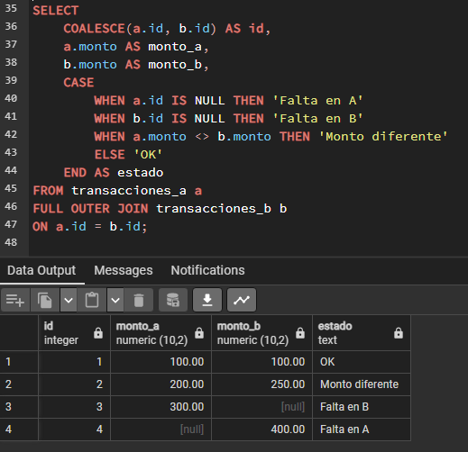
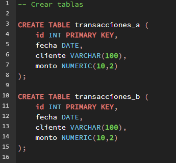
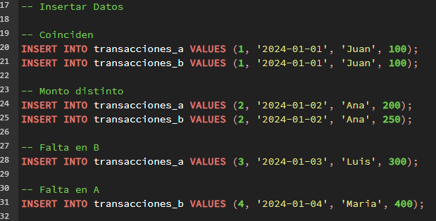

# Data Reconciliation Project (SQL)

## Objective
Simulate a real-world data reconciliation process between two transaction systems.

## Description
This project replicates a common business scenario where data from two different systems must be compared to identify inconsistencies.

## Business Context
Data reconciliation is a common process in organizations where multiple systems store transaction data.
This project simulates how inconsistencies can be detected and classified using SQL, similar to real-world financial and operational workflows.

## Example Output

## Tools
- PostgreSQL
- SQL

## Features
- Detection of missing records across systems
- Identification of mismatched transaction amounts
- Classification of inconsistencies (missing, mismatch, correct)

## Implementation Details

### Table Creation

### Data Insertion

## Key Concepts
- FULL OUTER JOIN for data comparison
- CASE statements for classification
- Data validation logic

## Files
- schema.sql: table definitions
- inserts.sql: sample data
- queries.sql: reconciliation logic

## Future Improvements
- Add detection of duplicate transactions
- Include additional fields (payment method, status)
- Create SQL views for reusable reconciliation queries
